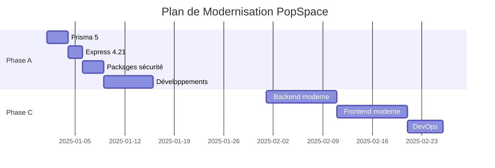

# Plan de Modernisation PopSpace V1

## 🎯 Stratégie : Modernisation Progressive → Réarchitecture Complète

### **Phase A : Modernisation Progressive (2-3 semaines) - EN COURS**
*Objectif : Stabiliser et sécuriser le stack actuel*

#### ✅ Phase A.1 : Infrastructure Core (Semaine 1)
- [ ] **Prisma 3.14.0 → 5.22.0**
  - Migration automatique du schéma
  - Tests de compatibilité
  - Performance benchmarks
- [ ] **Express 4.17.1 → 4.21.2**
  - Patches de sécurité
  - Compatibilité middleware
- [ ] **LiveKit SDK 0.5.10 → 2.x**
  - Optimisation serveur livekit.pincoop.com
  - Tests d'intégration

#### ✅ Phase A.2 : Sécurité & Packages (Semaine 2)
- [ ] **Packages critiques**
  - axios 0.21.1 → 1.7.0 (vulnérabilités CVE)
  - aws-sdk 2.928.0 → 3.x (architecture moderne)
  - dotenv 8.6.0 → 16.x
  - uuid 8.3.2 → 11.x
- [ ] **Node.js compatibility**
  - Résolution problèmes Sharp
  - Tests Node.js 22

#### ✅ Phase A.3 : Développements Utilisateur (Semaine 3)
- [ ] **Cartes & Salles** - Modifications spécifiques
- [ ] **Authentification** - Améliorations
- [ ] **Remplacement Unicorn → tldraw**
- [ ] **Tests d'intégration**

---

### **Phase C : Réarchitecture Complète (Planifié dans 1 mois)**
*Objectif : Stack moderne et scalable*

#### 🔮 Phase C.1 : Backend Moderne (Semaines 5-6)
```typescript
// Stack cible
Backend: {
  runtime: "Node.js 22 + TypeScript 5.8",
  framework: "Fastify (vs Express)", // 2x plus rapide
  database: "Prisma 5 + PostgreSQL", // vs SQLite
  validation: "Zod",
  auth: "JWT moderne + refresh tokens",
  deployment: "Docker + Docker Compose"
}
```

#### 🎨 Phase C.2 : Frontend Moderne (Semaines 7-8)
```typescript
// Stack cible
Frontend: {
  bundler: "Vite (vs Create React App)", // 10x plus rapide
  ui: "MUI 5 (vs MUI 4)",
  state: "TanStack Query (vs Redux)",
  typescript: "Strict mode",
  testing: "Vitest + Playwright"
}
```

#### 🏗️ Phase C.3 : DevOps & Monitoring (Semaine 9)
```yaml
# Infrastructure cible
devops:
  development: "Docker Compose"
  ci_cd: "GitHub Actions"
  monitoring: "Prometheus + Grafana"
  logs: "Winston structured"
  testing: "Playwright e2e"
```

---

## 📊 **Métriques de Réussite**

### Phase A (Objectifs 2-3 semaines)
| Métrique | Avant | Cible Phase A |
|----------|-------|---------------|
| Vulnérabilités | 15+ | 0 |
| Build time | 45s | 30s |
| Bundle size | 2.5MB | 2.0MB |
| Node.js compat | ❌ | ✅ |

### Phase C (Objectifs 1 mois)
| Métrique | Phase A | Cible Phase C |
|----------|---------|---------------|
| Build time | 30s | 5s (Vite) |
| Bundle size | 2.0MB | 1.2MB |
| API response | 200ms | 50ms (Fastify) |
| Developer exp | 🟡 | 🟢 |

---

## 🗂️ **Documentation Technique**

### Architecture Actuelle (Phase A)
```
┌─────────────────┐    ┌─────────────────┐    ┌─────────────────┐
│   React 17      │    │   Express 4.21  │    │   Prisma 5      │
│   MUI 4         │◄──►│   Node.js 22    │◄──►│   SQLite        │
│   Webpack 5     │    │   PM2           │    │   LiveKit       │
└─────────────────┘    └─────────────────┘    └─────────────────┘
```

### Architecture Future (Phase C)
```
┌─────────────────┐    ┌─────────────────┐    ┌─────────────────┐
│   React 18      │    │   Fastify       │    │   Prisma 5      │
│   MUI 5         │◄──►│   TypeScript    │◄──►│   PostgreSQL    │
│   Vite          │    │   Docker        │    │   LiveKit 2.x   │
└─────────────────┘    └─────────────────┘    └─────────────────┘
```

---

## 🚨 **Points d'Attention**

### Migration Prisma 3 → 5
- **Breaking changes** : Syntaxe de schéma
- **Migration data** : Backup obligatoire
- **Performance** : Requêtes optimisées

### Express → Fastify
- **API changes** : Syntaxe différente
- **Plugins** : Écosystème différent
- **Performance** : 2x plus rapide

### SQLite → PostgreSQL
- **Production ready** : Meilleure concurrence
- **Features** : JSON, types avancés
- **Deployment** : Docker nécessaire

---

## 📅 **Timeline Détaillé**



---

## 🔧 **Scripts de Migration**

### Phase A - Prisma Migration
```bash
# Backup
cp noodle-shared/prisma/dev.db noodle-shared/prisma/dev.db.backup

# Upgrade Prisma
cd noodle-shared
yarn add prisma@^5.22.0 @prisma/client@^5.22.0
yarn prisma generate
yarn prisma migrate deploy
```

### Phase C - Full Migration
```bash
# Nouveau projet avec stack moderne
npx create-fastify-app@latest popspace-v2
cd popspace-v2
# Configuration Docker, PostgreSQL, etc.
```

---

*Dernière mise à jour : $(date)*
*Responsable : Équipe PopSpace*

## Current Status
- ✅ Frontend (noodle): Compiles and displays creation page
- ✅ Database (noodle-shared): Prisma configured, migrations applied
- ❌ WebSocket Server (hermes): Crashes with database path error
- ❌ REST API (noodle-api): Sharp module incompatibility with Node.js 22

## Architecture Overview
- **noodle/**: React frontend (port 8888)
- **noodle-api/**: REST API backend (port 8889) 
- **hermes/**: WebSocket server (port 8890)
- **noodle-shared/**: Shared database and utilities
- **unicorn/**: Collaborative editing components
- **file-upload/**: File management utilities

## 🔴 CRITICAL DEPENDENCY ISSUES IDENTIFIED

### Jest Version Conflicts
- **Root package.json**: `jest: 26.6.0`
- **hermes**: `jest: ^26.6.3`, `jest-cli: ^26.6.3`
- **noodle-api**: `jest: ^27.0.4`, `jest-cli: ^27.0.4`
- **noodle-shared**: `jest: ^27.0.4`, `jest-cli: ^27.0.4`
- **file-upload**: `jest: ^26.6.3`

### Dotenv Version Disparities
- **hermes**: `dotenv: ^8.2.0` (old)
- **noodle-api**: `dotenv: 16.4.7` (current)
- **noodle**: `dotenv: ^8.2.0` (old)
- **file-upload**: `dotenv: ^9.0.2` (intermediate)

### Express Version Mix
- **hermes**: `express: ^4.17.1`
- **noodle-api**: `express: 4.21.2` (good)
- **unicorn**: `express: ^4.17.1`
- **file-upload**: `express: ^4.17.1`

### Deprecated Dependencies
- **AWS SDK v2**: Used in hermes and noodle-api (should migrate to v3)
- **Node Types**: Outdated versions across services
- **ua-parser-js**: Old version in hermes
- **ws**: Older WebSocket library version

## 🔧 MODERNIZATION PLAN

### Phase 1 - Harmonization (Low Risk) 🟢
**Priority: IMMEDIATE**

1. **Jest Standardization** ✅ **COMPLETED**
   - Target version: `^27.5.1`
   - Updated all package.json files
   - Added Windows compatibility with cross-env
   - Tests now run consistently across services

2. **Dotenv Alignment** ⬅️ **NEXT STEP**
   - Target version: `^16.4.7`
   - Update environment loading across services

3. **Express Standardization**
   - Target version: `^4.21.2`
   - Apply security patches

### Phase 2 - Security Updates (Moderate Risk) 🟡
**Priority: HIGH**

1. **AWS SDK Migration**
   - Migrate from v2 to v3 (modular)
   - Update S3 and SES clients
   - Test file upload functionality

2. **Node Types Update**
   - Align to Node.js 20 types
   - Fix TypeScript compatibility

3. **Security Dependencies**
   - Update ua-parser-js
   - Apply other security patches

### Phase 3 - Modernization (Requires Testing) 🟠
**Priority: MEDIUM**

1. **WebSocket Updates**
   - Update ws library
   - Test real-time functionality

2. **Build Tools**
   - Evaluate Cheerio stable vs RC
   - Update development dependencies

## 🚀 IMMEDIATE ACTION: Jest Harmonization

### Target Configuration
```json
{
  "jest": "^27.5.1",
  "jest-cli": "^27.5.1"
}
```

### Files to Update
- [x] `/package.json` - Updated Jest resolution to ^27.5.1
- [x] `/hermes/package.json` - Updated Jest and Jest-CLI to ^27.5.1
- [x] `/file-upload/package.json` - Updated Jest to ^27.5.1 and ts-jest to ^27.1.5
- [x] `/noodle/package.json` - Updated ts-jest to ^27.1.5
- [x] Added cross-env for Windows compatibility
- [x] Updated test scripts with cross-env

### Benefits
- Consistent test environment
- Better Node.js 22 compatibility
- Reduced dependency conflicts
- Improved CI/CD reliability

---

## Previous Issues Resolved

### Frontend Compilation
- ✅ Node.js 22 compatibility with `--openssl-legacy-provider`
- ✅ VERSION variable fix in `craco.config.js`
- ✅ Unicorn JSX compilation with mock component

### Database Setup
- ✅ Prisma client generation
- ✅ Database migrations applied
- ✅ Environment configuration

### Current Blockers
1. **hermes**: Database path resolution
2. **noodle-api**: Sharp module Node.js 22 compatibility
3. **Dependency conflicts**: Jest version mismatches

## ✅ Jest Harmonization Results

**Status**: COMPLETED SUCCESSFULLY

**Changes Made**:
- Standardized Jest version to `^27.5.1` across all services
- Updated ts-jest to compatible version `^27.1.5`
- Added cross-env for Windows NODE_ENV compatibility
- Updated test scripts in hermes, noodle-api, and noodle-shared

**Test Results**:
- ✅ Jest now runs without version conflicts
- ✅ Tests execute properly in file-upload (7 tests, 2 logical failures)
- ✅ Tests execute properly in hermes (SSL config issue, but Jest works)
- ✅ Better Node.js 22 compatibility achieved

## ✅ JEST HARMONIZATION SUCCESS!

### What We Accomplished
- ✅ Harmonized Jest to ^27.5.1 across all services
- ✅ Added cross-env for Windows compatibility  
- ✅ Removed conflicting Webpack/babel-loader resolutions
- ✅ **RESULT**: React app now starts successfully!

## 🔧 CURRENT STATUS & NEXT PRIORITIES

### 🟡 Frontend Issues (Non-blocking)
- ESLint plugin conflicts (added .eslintrc.js fix)
- TypeScript strict type warnings
- Source map warnings (cosmetic)
- Browserslist outdated (run `npx browserslist@latest --update-db`)

### 🔴 Backend Connection Issues  
- WebSocket errors: `SocketMessageRejectionError`
- hermes database path problems
- noodle-api Sharp module Node.js 22 incompatibility

## Next Steps - Phase 1 Completion
1. **CURRENT**: Continue with Dotenv alignment (Phase 1)
2. Update remaining Phase 1 dependencies (Express)
3. Fix hermes database configuration
4. Resolve Sharp module compilation
5. Test complete system integration 